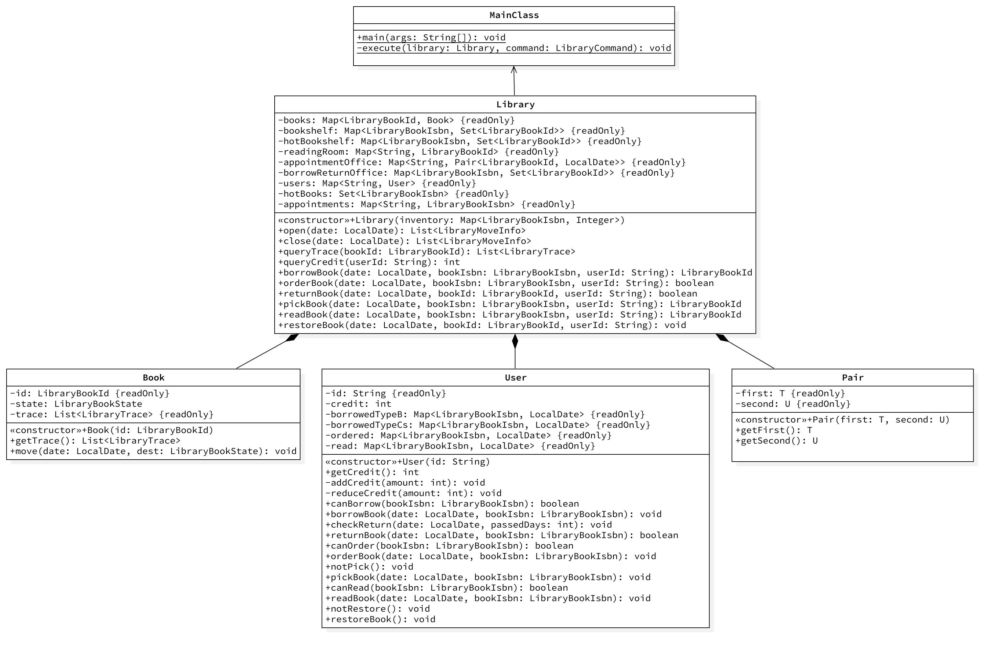

# BUAA-OO-2025-Unit4总结

## 一、正向建模与开发

本单元的正向建模即制作`UML`图，包括`UML`类图、`UML`状态图和`UML`顺序图。

其中`UML`类图是在开发开始前制作，`UML`状态图和`UML`顺序图是在开发完成后制作。

然而，“设计与实现相分离”的原则实践起来比较困难。对于习惯于“设计与实现一把抓”的笔者而言，在开发开始前设计类的个数、类的成员和类与类之间的关系尚可，设计方法个数、方法可见性和方法参数就显得异想天开。急于完成作业交差的心理下，笔者往往还不能充分理解情景，这会导致开发前能做的设计有限，做出的设计效果也有限，开发中不得不经常推翻或是反复修改，带来许多重复性、机械性的繁琐劳动。

这已经违背了“设计与实现相分离”的原则。为了突破困局，避免使用逆向生成工具，笔者认为有三种解决办法。一是肯花时间、下功夫，全面、充分、细致地理解情景，实则是做到设计时对实现心中有数；二是使用大模型辅助建模，让大模型代替人“全面、充分、细致地理解情景”，实则是第一种方案的现代化形式；三是让设计与实现彻底分离，即两个人合作分别完成设计与实现的任务，只允许有限的沟通交流，实际需要课程体系的改革。显然，第二种方案比较现实，笔者将在后文继续阐述。

`UML` 图的制作使用 `StarUML` 工具。该工具是付费工具，且无中文支持，但其试用期足以覆盖整个课程单元，且中文支持对于制作`UML`图而言并无帮助，是否选择使用破解和汉化脚本见仁见智。真正需要注意的是工具对工作图表与模型资源的分离，若选择逆向生成`UML`类图还需注意标准`UML`实践与课程要求的不同。

## 二、架构设计

最终的代码设计与`UML`模型设计之间基本对应。

显然，笔者的架构设计存在封装不足的问题，主要体现在未将各库存区域抽象为类，而是用裸的容器直接管理。这是由于笔者过于追求“避免过度封装”导致的，未考虑到可预期的迭代需求并不会引起大的架构变动，最终导致可维护性不足，强测出现错误。

## 三、大模型辅助体验

自使用大模型辅助理解`JML`之后，在课上实验的引导下，笔者体验了大模型辅助正向建模。

但与课上实验不同的是，笔者并未发现要求使用的那些“角色扮演”模式有其先进之处。对于当今有“预制提示词”的推理模型而言，直接提供指导书，加以简单的需求说明，已经足以应对课下作业。笔者猜测可能是作业情景相对简单，如果是现实中更为复杂的情景，可能就需要选择合适的方式，逐步引导大模型进行建模。

笔者听闻有同学在 `Unit3` 之后就不曾自己写过一行代码，虽有夸张之嫌，但也足以说明大模型在程序设计方面已达到可用，甚至是好用的程度。

## 四、架构设计思维的演进

四个单元的架构设计中，笔者从只关注代码编写，愈发认识到“设计”的重要性，也切身体会到时间紧迫的情况下进行“设计”的困难程度。

第一单元专注迭代式开发，重点是在迭代中保持代码的可拓展性，并选择适当的时机进行重构。

第二单元专注并发和多线程，重点是解决资源竞争、死锁等线程安全问题，同时避免忙等、轮询等线程性能问题。

第三单元专注契约式设计，重点是在满足`JML`要求的前提下，尽可能地提高性能、避免超时。

第四单元专注正向建模设计， 重点是制作`UML`图，用设计指导实现。

## 五、测试思维的演进

四个单元的测试中，笔者从只考虑黑盒测试，逐渐认识到白盒测试的必要性。

除第四单元未进行充分测试外，笔者均有利用评测机进行黑盒测试。然而，黑盒测试虽然简单方便，但无法保证覆盖率，特别是对极端情况的测试不足。第二单元互测时，手工构造的特殊测试点，往往更为有效；第三单元编写`Junit`进行单元测试时，针对`JML`契约构造合规测试，也是必然选择。

## 六、课程收获

《面向对象设计与构造》课程，名字不叫“`Java`语言程序设计”，有深刻的道理。

笔者在技术上的最大收获是并发和多线程。但比起技术进步，笔者在课程中最大的收获是深刻体会到“设计”的重要性。架构设计是一步错，步步错，错误越早挽回，危险越晚出现。只有架构合理，才有迭代空间；只有架构合理，才有优化余地！

然而，良好的设计只能建立在需求明确、不易改变的前提下。互联网时代的到来让这个前提失去了成立的基础。市场导向的“敏捷开发”，在理想情况下意味着达成设计时间和开发时间的平衡，但却常常表现为开发时间对设计时间的压缩，导致大量“技术债”、历史遗留问题和潜在安全漏洞，将项目推向彻底重构和彻底崩坏的两个深渊。这实际反应了程序虽然是项目核心，却没有、也无法得到重视。

